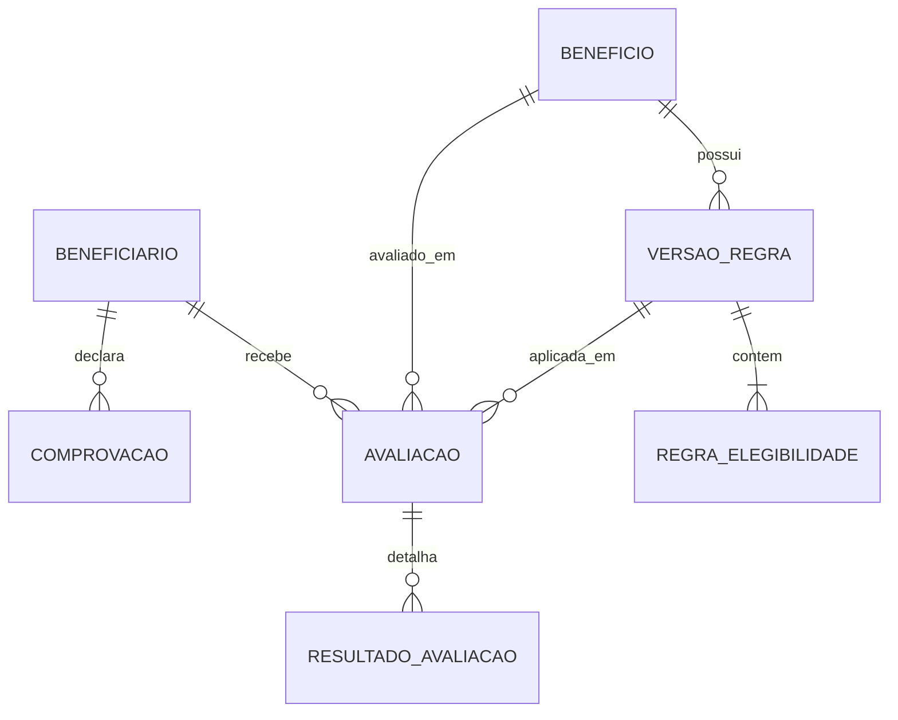

# Contrato do domínio do MVP

## Propósito e limites

Este contrato descreve um laboratório fictício de elegibilidade para benefícios sociais. Todos os registros e exemplos devem ser sintéticos. O sistema não representa processo oficial da OVG, não usa dados reais e não toma decisão administrativa oficial.

O contrato é conceitual: ele orientará modelagem e implementação em gates posteriores, mas não define migrations, Models Laravel ou Resources Filament neste gate.

## Vocabulário principal

| Conceito | Responsabilidade |
| --- | --- |
| **Beneficiário** | Reúne os fatos sintéticos sobre uma pessoa e sua composição familiar que podem alimentar avaliações. |
| **Benefício** | Identifica uma modalidade fictícia avaliável, sua descrição e se aceita novas avaliações. |
| **Comprovação** | Registra somente o estado de uma evidência declarada, sem arquivo ou conteúdo documental. |
| **Requisito** | Cataloga um fato consultável pelo motor, com código, tipo e fonte controlados. Não contém comparação nem decide elegibilidade. |
| **Versão de Regra** | Congela, para um Benefício e uma vigência, uma árvore de regras e suas referências. |
| **Regra de Elegibilidade** | Aplica um operador a um Requisito ou combina regras em grupos `AND`/`OR`. |
| **Parâmetro de Referência** | Fornece um valor global, tipado, versionado e vigente, como `SALARIO_MINIMO`. |
| **Avaliação** | Executa uma Versão de Regra para um Beneficiário e um Benefício em um instante determinado. |
| **Resultado de Avaliação** | Preserva o resultado de cada condição/grupo e o resultado automático consolidado. |

`Decisão Final` é um conceito distinto do resultado automático, mas fica fora do MVP. Se for autorizada futuramente, será uma entidade auditável associada à Avaliação, com decisão, justificativa, responsável e data, sem sobrescrever o resultado do motor.

## Relações conceituais

O diagrama representa apenas relações comuns. Um nó de Regra do tipo **Condição** consulta uma versão semântica específica de Requisito; um **Grupo** não consulta Requisito. Somente Condições que usam Parâmetro referenciam seu código lógico; condições com literal e grupos não têm Parâmetro. Uma Avaliação `INICIADA` ou em `FALHA_TECNICA` pode não ter resultados; uma `CONCLUIDA` exige resultados para todos os nós, snapshot e resultado consolidado. A forma física do schema será decidida somente no gate de implementação.

## Beneficiário

### Dados persistidos

| Dado | Obrigatoriedade | Observação |
| --- | --- | --- |
| Nome | Obrigatório | Nome claramente fictício. |
| Identificador sintético | Obrigatório e único no laboratório | Código inequivocamente fora do formato CPF, por exemplo `LAB-000001`; não é identificador oficial. |
| Data de nascimento | Obrigatória | Fonte para idade na data da avaliação. |
| Município e UF | Obrigatórios | Valores de laboratório; UF usa conjunto fechado válido. |
| Renda familiar mensal | Obrigatória | Valor não negativo e exato em centavos; não usar `float`. |
| Quantidade de integrantes da família | Obrigatória | Inteiro maior que zero. |
| Situação de vulnerabilidade | Obrigatória | Booleano declarado para o experimento. |
| Pessoa com deficiência | Obrigatória | Booleano declarado. |
| Limitação de mobilidade | Obrigatória | Booleano declarado. |
| Gestante | Obrigatória | Booleano declarado. |
| Nascimento do bebê ocorrido | Obrigatório quanto ao estado informado | `true`, `false` ou desconhecido (`null`); desconhecido nunca equivale a `false`. |
| Data provável do parto | Condicional | Obrigatória quando gestante; ausente nos demais estados do episódio. |
| Data de nascimento do bebê | Condicional | Obrigatória quando nascimento ocorrido é `true`; ausente quando `false` ou desconhecido. |
| Autonomia funcional | Opcional | Booleano; ausência significa fato não informado, não `false`. |
| Estado cadastral | Obrigatório | `ATIVO` ou `INATIVO`; a inativação impede nova avaliação. |

### Dados derivados no momento da avaliação

| Fato derivado | Origem | Regra do contrato |
| --- | --- | --- |
| Idade em anos completos | Data de nascimento + instante da avaliação | Não persistir como atributo atual do Beneficiário. |
| Renda per capita | Renda familiar ÷ integrantes | Quociente exato para decisão, sem arredondamento intermediário; integrantes deve ser maior que zero. |
| Semanas/meses de gestação | Data provável do parto + instante da avaliação | Resolver somente com episódio gestacional e entradas válidas; seguir a convenção de `MVP_EXAMPLES.md` sem transformar DPP inválida em mês válido. |
| Dias após nascimento | Data de nascimento do bebê + instante da avaliação | Resolver somente quando o nascimento ocorreu e a data é válida; não usar zero ou falso para ausência. |
| Presença efetiva de comprovação | Apresentação e validade + instante da avaliação | `VENCIDA` é estado derivado no instante, não valor cadastral persistido. |

Esses valores não são colunas redundantes do cadastro. A Avaliação preserva os valores calculados que efetivamente utilizou.

### Invariantes dos fatos sintéticos

- O cadastro representa **um único episódio gestacional**. `gestante = true` exige `nascimento ocorrido = false` e DPP válida. Nascimento ocorrido `true` encerra a gestação desse episódio: `gestante = false`, DPP ausente e data de nascimento do bebê obrigatória, não futura no calendário do laboratório. Com nascimento `false`, a data de nascimento fica ausente; com nascimento desconhecido, a data também fica ausente e a incerteza permanece explícita.
- DPP somente é permitida quando `gestante = true`. Para calcular `MES_GESTACIONAL`, a DPP deve situar-se de 0 a 280 dias após a data local da Avaliação; fora dessa janela o dado é inconsistente e o fato é `INDETERMINADA`. Não se limita um valor inválido para obter mês elegível.
- Renda familiar não pode ser negativa; quantidade de integrantes é inteiro maior que zero. Autonomia funcional ausente permanece desconhecida, sem inferência automática a partir de deficiência ou mobilidade.
- As datas usadas na validação são interpretadas em `America/Sao_Paulo` a partir do instante de referência UTC definido em `EVALUATION_HISTORY.md`.

Valores monetários de renda e Parâmetros monetários são persistidos em centavos exatos, sem `float`. Para uma condição `RENDA_PER_CAPITA <= L`, com renda total `R`, integrantes `N > 0` e limite `L` na mesma unidade, a comparação decisória é matematicamente `R <= L * N`. Cálculos usam aritmética inteira ou decimal exata; nenhuma formatação ou arredondamento de exibição altera o resultado. O snapshot conserva `R`, `N`, `L` e as versões usadas. A apresentação pode arredondar o quociente a duas casas.

Nenhum CPF real ou potencialmente válido é necessário. O identificador `LAB-000001` é um código local único do laboratório; não consultar bases externas para comprová-lo. Uma futura fixture visual com aparência de CPF deve ser deliberadamente inválida e nunca virar identificador oficial.

## Comprovação

O MVP não armazena uploads. Uma Comprovação pertence a um Beneficiário e possui:

- tipo fechado: `DOCUMENTO_IDENTIFICACAO`, `COMPROVANTE_ENDERECO`, `COMPROVANTE_RENDA`, `LAUDO_MEDICO`, `RELATORIO_PROFISSIONAL`, `CARTAO_GESTANTE` ou `ULTRASSONOGRAFIA`;
- estado persistido: `AUSENTE` ou `APRESENTADA`;
- data de apresentação obrigatória quando `APRESENTADA` e ausente quando `AUSENTE`;
- validade opcional apenas quando `APRESENTADA`;
- timestamps de auditoria.

Há no máximo um estado corrente por Beneficiário e tipo. A ausência de registro para um tipo consultado equivale a `AUSENTE`. A data de apresentação não pode ser futura em relação à data local do servidor no cadastro e a validade não pode anteceder a apresentação. `VENCIDA` é **derivada**, nunca persistida como estado independente: `APRESENTADA` conta como presente se sua apresentação já ocorreu e sua validade está ausente ou é igual/posterior à data local da Avaliação. A validade é inclusiva no último dia. A Avaliação registra apresentação, validade e estado efetivo no instante; não depende do cadastro corrente para explicar o passado.

## Benefício

Possui código estável, nome, descrição fictícia e estado `ATIVO`/`INATIVO`. A desativação impede novas avaliações, sem apagar versões ou avaliações anteriores. Os cinco Benefícios de referência estão em [MVP_EXAMPLES.md](MVP_EXAMPLES.md).

## Requisito e Regra de Elegibilidade

A separação será adotada:

- o **Requisito** é um catálogo de fatos permitidos, por exemplo `IDADE_ANOS`, `RENDA_PER_CAPITA`, `GESTANTE`, `NASCIMENTO_BEBE_OCORRIDO`, `DEFICIENCIA`, `LAUDO_MEDICO` e `AUTONOMIA_FUNCIONAL`; ele define código lógico estável, versão semântica imutável, rótulo, tipo e fonte/resolvedor permitido;
- a **Regra de Elegibilidade** expressa uma condição, como `IDADE_ANOS LTE 2`, ou um grupo lógico composto por condições.

Essa separação impede paths ou consultas livres, permite validar operadores por tipo e mantém os textos de explicação consistentes. Uma Versão de Regra publicada referencia uma **versão semântica específica** do Requisito, como `IDADE_ANOS/v1`. Mudança de fórmula ou resolvedor que possa mudar o resultado exige nova versão semântica e nova Versão de Regra. A versão anterior não pode ser substituída silenciosamente. Nenhum PHP, hash de código executável ou plugin é armazenado no banco para esse controle.

## Versão de Regra

Cada versão pertence a exatamente um Benefício e possui número sequencial, estado, início e fim opcional de vigência, árvore declarativa e metadados de publicação. O ciclo, a imutabilidade e a substituição estão definidos em [EVALUATION_HISTORY.md](EVALUATION_HISTORY.md).

## Parâmetro de Referência

O conceito entra no MVP porque o exemplo de renda precisa de um valor como `SALARIO_MINIMO` sem duplicá-lo em regras. Cada valor possui código estável, tipo, valor, início e fim opcional de vigência e histórico imutável após uso. A Regra referencia o **código lógico**; a Avaliação resolve e congela a versão vigente e o valor realmente usados no seu instante de referência.

## Avaliação e Resultado de Avaliação

Uma Avaliação liga exatamente um Beneficiário, um Benefício e uma Versão de Regra, com instante de referência, snapshot de entradas, resultado automático consolidado quando concluída e timestamps. Em uma Avaliação `CONCLUIDA`, cada condição e grupo gera um Resultado de Avaliação com caminho estável na árvore, valores observado e esperado, desfecho e explicação.

Os estados automáticos são `ELEGIVEL`, `INELEGIVEL`, `PENDENTE_DOCUMENTACAO` e `REQUER_ANALISE_HUMANA`. Eles não equivalem a concessão administrativa. A semântica e a precedência estão em [ELIGIBILITY_ENGINE.md](ELIGIBILITY_ENGINE.md).

O MVP demonstra **análise de elegibilidade**. A interface e a apresentação devem usar “ELEGÍVEL”, “INELEGÍVEL”, “PENDENTE DE DOCUMENTAÇÃO” e “REQUER ANÁLISE HUMANA” para os quatro estados automáticos. “APROVADO” e “REPROVADO” não são sinônimos e ficam fora da demonstração enquanto não houver Decisão Final humana.

## Exclusão, retenção e auditoria

- Beneficiário, Benefício, Requisito e Parâmetro referenciados por histórico são inativados, não apagados.
- Rascunhos nunca publicados podem ser excluídos; versões publicadas e avaliações concluídas não podem ser excluídas pelo fluxo normal.
- Não será aplicado soft delete indistintamente. Estado explícito atende aos catálogos; imutabilidade atende versões e avaliações.
- Uma limpeza integral de ambiente sintético é operação administrativa do laboratório, fora do fluxo funcional e sem promessa de preservação histórica.
- Criação, publicação, substituição, inativação e avaliação devem ter timestamps e autoria quando houver identidade de operador disponível em gate futuro.

## Concorrência

**Decisão: NÃO ADOTAR optimistic locking NESTE MVP.** O piloto terá poucos operadores e não justifica versionamento concorrente em todos os registros. A futura publicação de uma Versão de Regra deve usar transação e restrições de unicidade para impedir duas versões vigentes conflitantes. Se uso concorrente real aparecer, o contrato será revisto antes de introduzir controle adicional.

## Compatibilidade com até 10 telas

O contrato cabe em nove telas futuras, sem autorizar sua implementação:

1. Dashboard;
2. lista de Beneficiários;
3. cadastro/edição de Beneficiário, incluindo Comprovações;
4. lista e edição de Benefícios;
5. catálogo de Requisitos e Parâmetros;
6. versões e regras do Benefício;
7. nova Avaliação;
8. resultado explicável da Avaliação;
9. painel consolidado do Beneficiário.

Comprovações, Parâmetros e versões são seções de telas relacionadas, evitando ampliar o MVP apenas para refletir cada conceito em uma tela própria.

## Fora do MVP

- dados reais e integrações com a OVG;
- upload ou armazenamento de arquivos;
- autenticação corporativa e RBAC;
- filas, notificações e APIs externas;
- IA dentro da aplicação;
- decisão automática oficial ou concessão de benefício;
- Decisão Final humana implementada;
- ProBem complexo, estoque, pagamentos ou assinatura digital;
- workflow corporativo completo.
