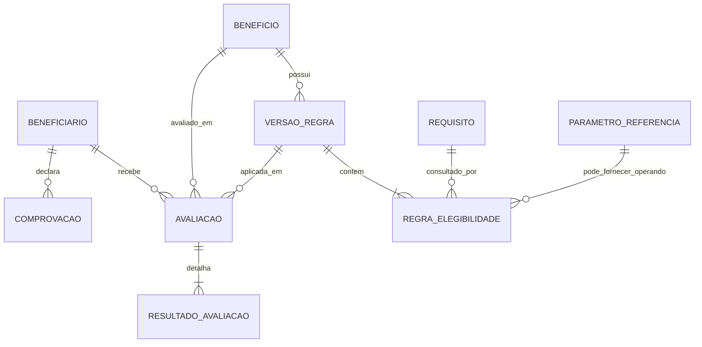

# Contrato do domínio do MVP

## Propósito e limites

Este contrato descreve um laboratório fictício de elegibilidade para benefícios sociais. Todos os registros e exemplos devem ser sintéticos. O sistema não representa processo oficial da OVG, não usa dados reais e não toma decisão administrativa oficial.

O contrato é conceitual: ele orientará modelagem e implementação em gates posteriores, mas não define migrations, Models Laravel ou Resources Filament neste gate.

## Vocabulário principal

| Conceito | Responsabilidade |
| --- | --- |
| **Beneficiário** | Reúne os fatos sintéticos sobre uma pessoa e sua composição familiar que podem alimentar avaliações. |
| **Benefício** | Identifica uma modalidade fictícia avaliável, sua descrição e se aceita novas avaliações. |
| **Comprovação** | Registra somente o estado de uma evidência declarada, sem arquivo ou conteúdo documental. |
| **Requisito** | Cataloga um fato consultável pelo motor, com código, tipo e fonte controlados. Não contém comparação nem decide elegibilidade. |
| **Versão de Regra** | Congela, para um Benefício e uma vigência, uma árvore de regras e suas referências. |
| **Regra de Elegibilidade** | Aplica um operador a um Requisito ou combina regras em grupos `AND`/`OR`. |
| **Parâmetro de Referência** | Fornece um valor global, tipado, versionado e vigente, como `SALARIO_MINIMO`. |
| **Avaliação** | Executa uma Versão de Regra para um Beneficiário e um Benefício em um instante determinado. |
| **Resultado de Avaliação** | Preserva o resultado de cada condição/grupo e o resultado automático consolidado. |

`Decisão Final` é um conceito distinto do resultado automático, mas fica fora do MVP. Se for autorizada futuramente, será uma entidade auditável associada à Avaliação, com decisão, justificativa, responsável e data, sem sobrescrever o resultado do motor.

## Relações conceituais

O diagrama representa responsabilidades e cardinalidades esperadas. A forma física do schema será decidida somente no gate de implementação.

## Beneficiário

### Dados persistidos

| Dado | Obrigatoriedade | Observação |
| --- | --- | --- |
| Nome | Obrigatório | Nome claramente fictício. |
| CPF sintético | Obrigatório e único no laboratório | Deve ser gerado para teste e identificado como sintético; nunca copiar CPF real. |
| Data de nascimento | Obrigatória | Fonte para idade na data da avaliação. |
| Município e UF | Obrigatórios | Valores de laboratório; UF usa conjunto fechado válido. |
| Renda familiar mensal | Obrigatória | Decimal não negativo. |
| Quantidade de integrantes da família | Obrigatória | Inteiro maior que zero. |
| Situação de vulnerabilidade | Obrigatória | Booleano declarado para o experimento. |
| Pessoa com deficiência | Obrigatória | Booleano declarado. |
| Limitação de mobilidade | Obrigatória | Booleano declarado. |
| Gestante | Obrigatória | Booleano declarado. |
| Data provável do parto | Condicional | Permitida quando gestante; usada para derivar o período gestacional. |
| Data de nascimento do bebê | Opcional | Usada para derivar dias após o nascimento. |
| Autonomia funcional | Opcional | Booleano; ausência significa fato não informado, não `false`. |
| Estado cadastral | Obrigatório | `ATIVO` ou `INATIVO`; a inativação impede nova avaliação. |

### Dados derivados no momento da avaliação

| Fato derivado | Origem | Regra do contrato |
| --- | --- | --- |
| Idade em anos completos | Data de nascimento + instante da avaliação | Não persistir como atributo atual do Beneficiário. |
| Renda per capita | Renda familiar ÷ integrantes | Calcular com precisão decimal definida na implementação; integrantes deve ser maior que zero. |
| Semanas/meses de gestação | Data provável do parto + instante da avaliação | Usar convenção documentada e determinística; o valor calculado entra no snapshot. |
| Dias após nascimento | Data de nascimento do bebê + instante da avaliação | Valores negativos indicam que o nascimento ainda não ocorreu. |
| Presença efetiva de comprovação | Estado e validade da Comprovação + instante da avaliação | Uma comprovação vencida não conta como presente. |

Esses valores não são colunas redundantes do cadastro. A Avaliação preserva os valores calculados que efetivamente utilizou.

## Comprovação

O MVP não armazena uploads. Uma Comprovação pertence a um Beneficiário e possui:

- tipo fechado: `DOCUMENTO_IDENTIFICACAO`, `COMPROVANTE_ENDERECO`, `COMPROVANTE_RENDA`, `LAUDO_MEDICO`, `RELATORIO_PROFISSIONAL`, `CARTAO_GESTANTE` ou `ULTRASSONOGRAFIA`;
- estado: `AUSENTE`, `APRESENTADA` ou `VENCIDA`;
- data de apresentação, quando apresentada;
- validade opcional;
- timestamps de auditoria.

Há no máximo um estado corrente por Beneficiário e tipo. A ausência de registro para um tipo consultado equivale a `AUSENTE`. `APRESENTADA` só é efetivamente presente quando a validade estiver ausente ou não tiver expirado no instante da avaliação. A Avaliação registra o estado resolvido; não depende do estado corrente para explicar o passado.

## Benefício

Possui código estável, nome, descrição fictícia e estado `ATIVO`/`INATIVO`. A desativação impede novas avaliações, sem apagar versões ou avaliações anteriores. Os cinco Benefícios de referência estão em [MVP_EXAMPLES.md](MVP_EXAMPLES.md).

## Requisito e Regra de Elegibilidade

A separação será adotada:

- o **Requisito** é um catálogo de fatos permitidos, por exemplo `IDADE_ANOS`, `RENDA_PER_CAPITA`, `GESTANTE`, `DEFICIENCIA`, `LAUDO_MEDICO` e `AUTONOMIA_FUNCIONAL`; ele define código estável, rótulo, tipo e fonte/resolvedor permitido;
- a **Regra de Elegibilidade** expressa uma condição, como `IDADE_ANOS LTE 2`, ou um grupo lógico composto por condições.

Essa separação impede paths ou consultas livres, permite validar operadores por tipo e mantém os textos de explicação consistentes. Requisitos publicados e já referenciados não mudam de significado; uma mudança semântica exige novo código.

## Versão de Regra

Cada versão pertence a exatamente um Benefício e possui número sequencial, estado, início e fim opcional de vigência, árvore declarativa e metadados de publicação. O ciclo, a imutabilidade e a substituição estão definidos em [EVALUATION_HISTORY.md](EVALUATION_HISTORY.md).

## Parâmetro de Referência

O conceito entra no MVP porque o exemplo de renda precisa de um valor como `SALARIO_MINIMO` sem duplicá-lo em regras. Cada valor possui código estável, tipo, valor, início e fim opcional de vigência e histórico imutável após uso. A Regra referencia uma versão resolvível por vigência; a Avaliação congela a versão e o valor realmente usados.

## Avaliação e Resultado de Avaliação

Uma Avaliação liga exatamente um Beneficiário, um Benefício e uma Versão de Regra, com instante de referência, snapshot de entradas, resultado automático consolidado e timestamps. Cada condição e grupo gera um Resultado de Avaliação com caminho estável na árvore, valores observado e esperado, desfecho e explicação.

Os estados automáticos são `ELEGIVEL`, `INELEGIVEL`, `PENDENTE_DOCUMENTACAO` e `REQUER_ANALISE_HUMANA`. Eles não equivalem a concessão administrativa. A semântica e a precedência estão em [ELIGIBILITY_ENGINE.md](ELIGIBILITY_ENGINE.md).

## Exclusão, retenção e auditoria

- Beneficiário, Benefício, Requisito e Parâmetro referenciados por histórico são inativados, não apagados.
- Rascunhos nunca publicados podem ser excluídos; versões publicadas e avaliações concluídas não podem ser excluídas pelo fluxo normal.
- Não será aplicado soft delete indistintamente. Estado explícito atende aos catálogos; imutabilidade atende versões e avaliações.
- Uma limpeza integral de ambiente sintético é operação administrativa do laboratório, fora do fluxo funcional e sem promessa de preservação histórica.
- Criação, publicação, substituição, inativação e avaliação devem ter timestamps e autoria quando houver identidade de operador disponível em gate futuro.

## Concorrência

**Decisão: NÃO ADOTAR optimistic locking NESTE MVP.** O piloto terá poucos operadores e não justifica versionamento concorrente em todos os registros. A futura publicação de uma Versão de Regra deve usar transação e restrições de unicidade para impedir duas versões vigentes conflitantes. Se uso concorrente real aparecer, o contrato será revisto antes de introduzir controle adicional.

## Compatibilidade com até 10 telas

O contrato cabe em nove telas futuras, sem autorizar sua implementação:

1. Dashboard;
2. lista de Beneficiários;
3. cadastro/edição de Beneficiário, incluindo Comprovações;
4. lista e edição de Benefícios;
5. catálogo de Requisitos e Parâmetros;
6. versões e regras do Benefício;
7. nova Avaliação;
8. resultado explicável da Avaliação;
9. painel consolidado do Beneficiário.

Comprovações, Parâmetros e versões são seções de telas relacionadas, evitando ampliar o MVP apenas para refletir cada conceito em uma tela própria.

## Fora do MVP

- dados reais e integrações com a OVG;
- upload ou armazenamento de arquivos;
- autenticação corporativa e RBAC;
- filas, notificações e APIs externas;
- IA dentro da aplicação;
- decisão automática oficial ou concessão de benefício;
- Decisão Final humana implementada;
- ProBem complexo, estoque, pagamentos ou assinatura digital;
- workflow corporativo completo.
